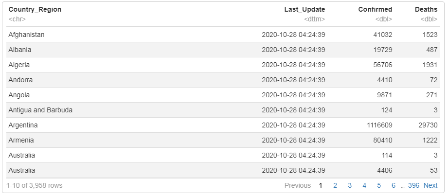
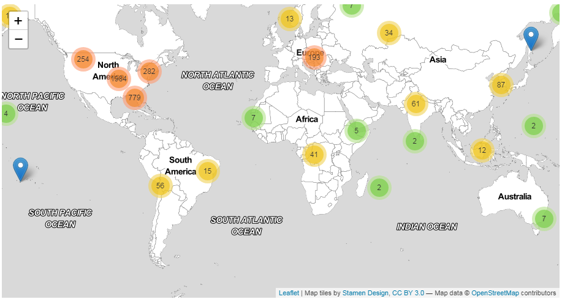
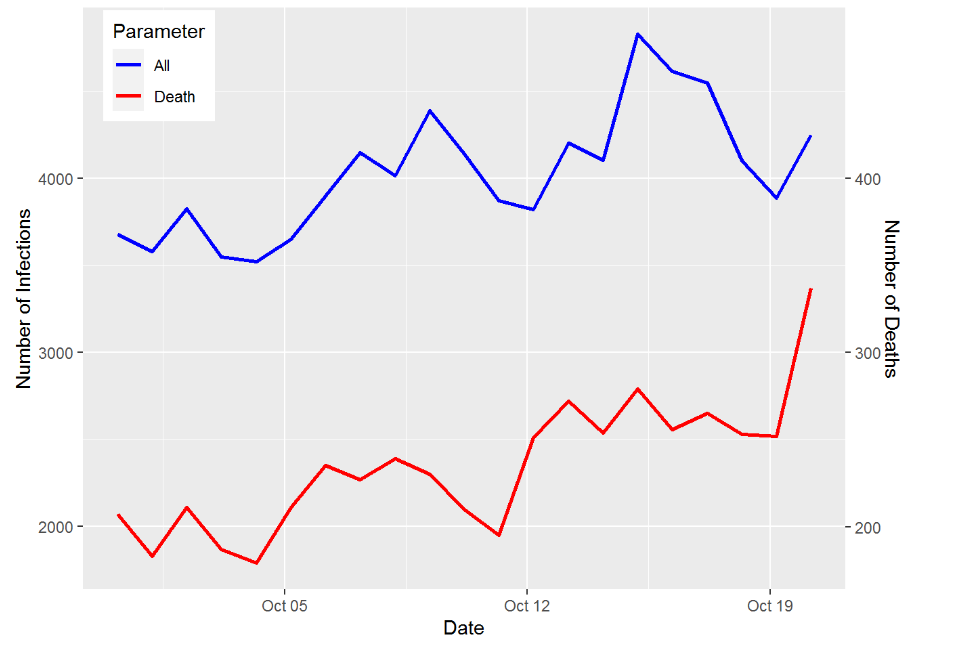

## covid19 Package 

### Goal

The goal of covid19 package is to explore John-Hopkins covid-19 dataset to get more information about spread of infections and deaths due to this virus all around the world.

### How to install?

You can install the development version  of covid19 from [GitHub](https://github.com/) with:

``` r
# install.packages("devtools")
devtools::install_github("sanazy/covid19")
```

### How to use it?

This package has 3 main functions as follow:

#### Function 1: covidData

You can get a dataframe including name of countries, cumulative number of death and infected people for each country until today by calling this function:

```r
library(covid19)
covidData()
```


#### Function 2: worldMapPlot

You can take a look at number of death or all infected people in each country in any date on world map by calling this following function. 


Colorful circles indicate how many regions are clustered to form a circle. To get more information from each country, you must zoom in.


You can pass any date from "2020-01-22" till today as first parameter. The date format must be like this yyyy-mm-dd, where yyyy is the year, mm is the month and dd is the day.

```r
worldMapPlot(date = "2020-10-01", type = "death")
```


If you want to know the number of deaths, you must pass "death" as second parameter. Otherwise, you can access to number of all infected people by passing "all".

```r
worldMapPlot(date = "2020-10-25", type = "all")
```


#### Function 3: timeSeriesPlot

You can plot time series plots of number of deaths and infections from any given time range and for any country name using following function.

Please note that scale of number of all infected is on left-handed y-axis and the number of deaths is on right-handed y-axis.

You can pass any date from "2020-01-22" as first start_date parameter and any date after that as end_date. The date format must be like this yyyy-mm-dd, where yyyy is the year, mm is the month and dd is the day. 

```r
timeSeriesPlot(start_date = "2020-09-30", end_date   = "2020-10-20", country_name = "Iran")
```

